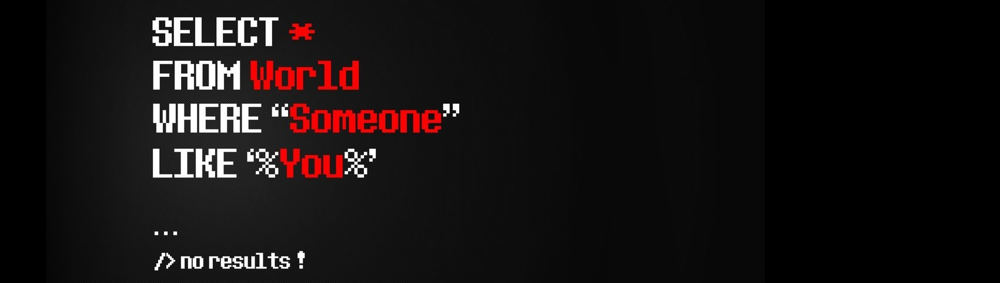

    <h1> FULL STACK DEVELOPMENT </h1>
    
 Amante de la tecnología y el diseño, estoy en la última instancia de mi proceso Full Stack en Henry donde aprendo <b>JavaScript </b>, 
    <b>React</b> / <b>Redux</b>, <b>NodeJS</b>, <b>Sequelize</b>, <b>Express</b>, algo de <b>HTML</b> y <b>CSS</b> entre muchas otras cosas como <b>softs skills</b> 
    como lo es el trabajo en equipo, super importante para coloborar de manera remota en cualquier parte del mundo y que igual se puede aplicar en casa porque no.

    <h1> ¿QUÉ ESTOY HACIENDO?</h1>
    
 En equipo estamos realizando un App para vender ticket de cine tanto de manera presencial como para ver en casa. 
    De primera mano nos muestra un pequeño carrusel con películas relevantes y un catálogo de todo lo que hay disponible para ver.
    En cuanto quede lista subiré el Repo para qye puedan darle un vistazo.

    <h1> ¿QUÉ HE HECHO?</h1>
    
 En los últimos años me he desempeñado como <b>diseñador gráfico</b> creando publicidad impresa y digital para varias empresas. 
    Desde gráficos para redes sociales, hasta catálogos impresos y videos promocionales realizados con <b>After Effects</b>, un potente software de animación de Adobe. 
    He tomado cursos de <b>Romans CAD</b> para aprender a desarrollar calzado por computadora, siendo ésta mi última actividad en la que duré 4 años completos. 
    En materia web he realizado algunos sitios de los cuales tengo varios repos aquí en GitHub.

    <h1> PARA CONTACTAR CONMIGO</h1>
    
 Te dejo algunos datos que podrían servirte para ponernos en contacto, sea por alguna duda o simplemente para decir HOLA !!!.

    

        <a className="Link" href="https://www.linkedin.com/in/daniel-full-stack/" target="_blank"><h2>Linkedin</h2></a>
    

### Hi there 👋

<!--
**BtoMJ/BtoMJ** is a ✨ _special_ ✨ repository because its `README.md` (this file) appears on your GitHub profile.

Here are some ideas to get you started:

- 🔭 I’m currently working on ...
- 🌱 I’m currently learning ...
- 👯 I’m looking to collaborate on ...
- 🤔 I’m looking for help with ...
- 💬 Ask me about ...
- 📫 How to reach me: ...
- 😄 Pronouns: ...
- ⚡ Fun fact: ...
-->
